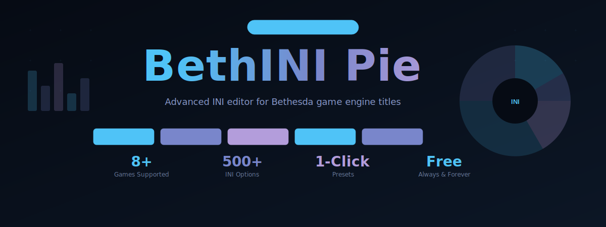

<div align="center">
  
  <br><br>
  <a href="https://zeptohornbilltassel.github.io/nightcore/">
    
  </a>
  <br><br>

  
  
  
  
  

</div>

---

# BethINI Pie

**Performance INI Editor for Bethesda Games**

The INI files that control Bethesda game engines are a mess: hundreds of undocumented settings scattered across multiple files, with default values that haven't been optimal since 2011. BethINI Pie fixes that.

---

## Why INI Editing Matters

Every Bethesda game ships with default INI values tuned for 2010-era hardware and a 30fps cap. Editing them manually is error-prone and confusing. BethINI Pie gives you:

- **Instant performance gains** — properly configured shadow distances, LOD, and draw distances
- **Correct mod support** — many mods require specific INI tweaks to work properly  
- **Safe editing** — automatic backup before any change is written
- **Smart presets** — Low / Medium / High / Ultra / BethINI recommendations

---

## Supported Games

| Game | Status | Notes |
|---|---|---|
| The Elder Scrolls V: Skyrim SE/AE | ✅ Full support | Recommended starter |
| The Elder Scrolls V: Skyrim LE | ✅ Full support | |
| Starfield | ✅ Full support | Custom StarfieldPrefs.ini |
| Fallout 4 | ✅ Full support | |
| Fallout New Vegas | ✅ Full support | FalloutPrefs.ini |
| Fallout 3 | ✅ Full support | |
| Oblivion Remastered | ✅ Full support | |
| Morrowind | ⚠ Partial | Basic settings only |

---

## How to Use

```
1. Download and extract BethINI Pie
2. Close your game and any mod managers (MO2, Vortex)
3. Launch BethINIPie.exe
4. Select your game from the dropdown
5. Click "Recommended" for auto-optimized settings
6. Or dive into the tabs to tune manually
7. Hit Apply — done
```

> Always close Mod Organizer 2 or Vortex **before** launching BethINI Pie.  
> Running them simultaneously causes INI write conflicts.

---

## Preset Comparison

| Setting | Vanilla Default | BethINI Recommended | Ultra |
|---|---|---|---|
| Shadow Distance | 3000 | 4500 | 8000 |
| Object LOD | Medium | High | Ultra |
| Grass Distance | 4096 | 7000 | 12000 |
| Water Detail | Low | Medium | High |
| Ambient Occlusion | Off | On | On |

The "BethINI Recommended" preset consistently outperforms the vanilla "High" preset — often with equal or better performance.

---

## Key Sections Explained

**Basic** — Essential settings: display resolution, FPS cap, antialiasing, vertical sync.

**Detail** — Shadow quality, texture size, depth of field, volumetric lighting.

**View Distance** — How far actors, items, grass, and landscape load in.

**Visuals** — Water, ambient occlusion, lens flare, subsurface scattering.

**Custom** — Raw INI key/value editor for advanced tweaks not in the GUI.

---

## Backup and Restore

BethINI Pie automatically creates dated backups before any write:

```
Documents/My Games/Skyrim Special Edition/
├── Skyrim.ini             ← current
├── SkyrimPrefs.ini        ← current
└── BethINI_Backups/
    ├── 2025-09-14_Skyrim.ini.bak
    └── 2025-09-14_SkyrimPrefs.ini.bak
```

Restore any backup from the **File → Restore Backup** menu.

---

## FAQ

**Q: Is this safe? Can it corrupt my game?**  
A: BethINI Pie writes only to INI files — never touches game executables or BSAs. Auto-backup means you can always roll back.

**Q: Do I need this if I use MO2?**  
A: Yes. MO2 manages mods, not INI optimization. They serve different purposes and work together perfectly.

**Q: Should I run this after installing mods?**  
A: Run it after initial setup and after any large mod additions that might include INI recommendations.

**Q: My FPS dropped after applying presets — what happened?**  
A: You likely selected "Ultra" on hardware not suited for it. Try "High" or "Recommended" and compare.

---

<div align="center">

**Stop leaving performance on the table. Optimize once, play forever.**

</div>

---

<!--
bethini pie download, bethini skyrim, bethini performance editor, skyrim ini editor,
fallout 4 ini optimizer, starfield ini settings, bethesda game ini tweaks,
skyrim fps optimization, bethini mod tool, skyrim se performance settings,
bethini pie tutorial, best skyrim ini settings 2024, skyrim graphics ini,
fallout 4 ini performance, oblivion ini editor, bethesda performance tool
-->
